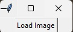
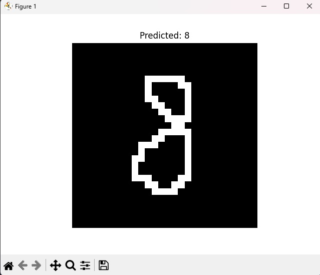

# Source code for Handwritten Digit and Fashion Image Classification

## About
HCMUS Computer Vision Homework 03

Date: 04-06-2025

This repository contains the source code for a simple handwritten digit and fashion image classification project using Feedforward Neural Networks. The project includes a GUI application for loading images and displaying the classification results.

## Installation

```bash
pip install -r requirements.txt
```

## Usage
### Training
- Add your dataset to the `data` folder, including  and .
- Run the training scripts in `scripts` folder.
- The models will be saved in the `builds` folder.
### GUI application
- Run the `main.py` file.
- Load an image .
- Result will be shown in the GUI .

## Models
- Net3 (1 input layer, 1 hidden layer, 1 output layer): using simple Feedforward Neural Network
- Net4 (1 input layer, 2 hidden layers, 1 output layer): using simple Feedforward Neural Network


